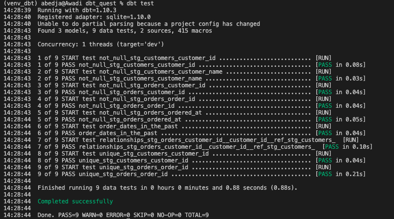

# ✅ Tests DBT - Qualité des données

Ce dossier contient des tests pour garantir la fiabilité et l'intégrité des données dans le projet DBT `dbt_quest`.

---

## 🔍 Types de tests inclus

### ✅ Tests intégrés (`.yml`)
Définis dans les fichiers `stg_customers.yml` et `stg_orders.yml` :
- `not_null` : vérifie que les colonnes ne contiennent pas de valeurs nulles.
- `unique` : s’assure que les identifiants sont uniques.
- `relationships` : valide que les `customer_id` dans `stg_orders` existent bien dans `stg_customers`.

### ✅ Test personnalisé (`order_dates_in_the_past.sql`)
- Vérifie que la colonne `ordered_at` de `stg_orders` ne contient pas de date future.

---

## 🚀 Résultat d'exécution (via `dbt test`)

