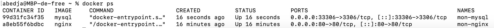

# 🐳 Défi Docke - Introduction

## 💪 Objectif

Exécuter deux conteneurs :
- Un serveur **nginx** exposé sur le port **80**
- Un serveur **MySQL** exposé sur le port **3306** (remappé ici sur **33306**)

Les conteneurs doivent être exécutés en mode détaché avec des noms personnalisés (`mon-nginx` et `mon-mysql`).

---

## 📸 Capture 1 : Conteneurs en cours d'exécution

> Inclure ici une capture d’écran de la commande `docker ps` montrant les deux conteneurs actifs



---

## ✅ Vérifications

| Conteneur     | Statut attendu | Port              | ✔️ |
|---------------|----------------|-------------------|----|
| `mon-nginx`   | Up             | 80:80             | ✅ |
| `mon-mysql`   | Up             | 33306:3306        | ✅ |

---

## 🧹 Nettoyage

Commandes utilisées pour arrêter et supprimer les conteneurs :

```bash
docker stop mon-nginx mon-mysql
docker rm mon-nginx mon-mysql
```
