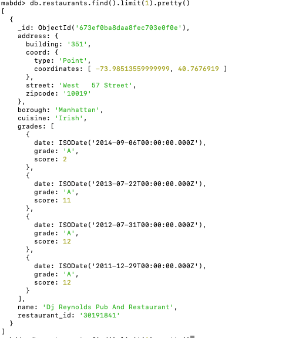
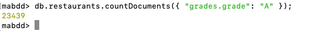
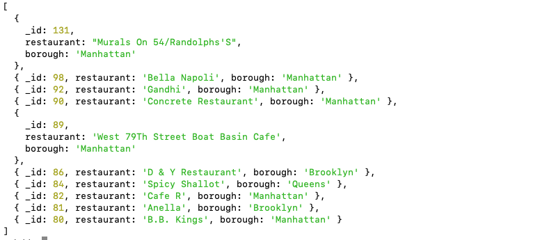
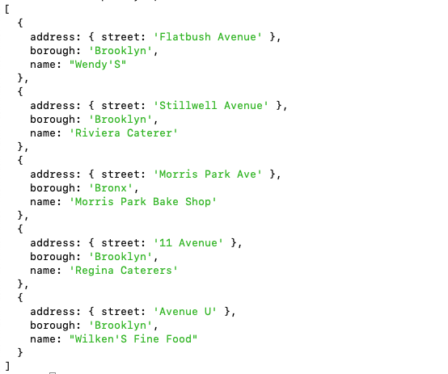
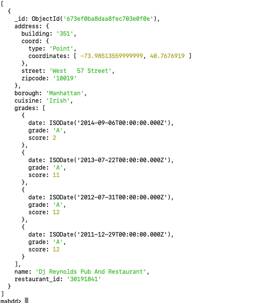
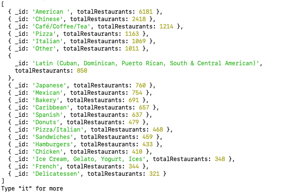
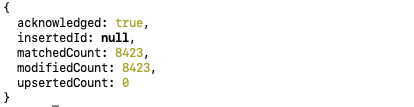
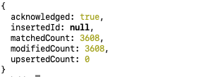
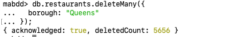

# Quete MongoDB : Non au SQL X Mongodb

## 1. Utilisation depuis le Terminal
Pour lancer le serveur MongoDB, on ouvre un terminal et exécute la commande suivante :

```sh
mongod
```

Cette commande démarre le serveur MongoDB. Assurez-vous d'avoir configuré le bon chemin pour la base de données dans votre fichier de configuration (`mongod.conf`), ou MongoDB utilisera le répertoire par défaut.

Ensuite, ouvrez un nouveau terminal pour vous connecter au shell MongoDB avec la commande :

```sh
mongosh
```

Cela vous connectera au shell interactif MongoDB.

## 2. Créer une Base de Données

Dans le shell MongoDB (`mongosh`), pour créer une base de données, on utilise la commande suivante :

```javascript
use mabdd;
```

Cela va soit créer une nouvelle base de données nommée `mabdd`, soit la sélectionner si elle existe déjà. Notez que MongoDB ne crée la base de données que lorsque des collections et des données y sont ajoutées.

## 3. Switcher entre Bases de Données

Pour passer d'une base de données à une autre dans le shell MongoDB, utilisez simplement la commande `use`.

```javascript
use autre_base_de_donnees;
```

Cela vous permet de changer de contexte vers une autre base de données.

## 4. Créer une Collection

Pour créer une nouvelle collection, on peut insérer un document directement. Par exemple, pour créer une collection `restaurants`, on utilise :

```javascript
db.createCollection("restaurants");
```

## 5. Importer des Données depuis un Fichier JSON

Pour importer des données à partir d'un fichier JSON, vous pouvez utiliser l'outil `mongoimport` dans le terminal. Pour le fichier `restaurants.json`, on l'importe ainsi :

```sh
mongoimport --db mabdd --collection restaurants --file /Users/abedja/IaPM_WcS/Quetes/week3/mongoDB/restaurants.json
```

Cela ajoutera toutes les entrées du fichier JSON dans la collection `restaurants` de la base de données `mabdd`. Ne pas oublier de spécifier le chemin vers le fichier.

### Explication des Options de `mongoimport`
- `--db mabdd` : Spécifie la base de données cible (`mabdd`).
- `--collection restaurants` : Indique la collection cible (`restaurants`).
- `--file restaurants.json` : Chemin vers le fichier JSON contenant les données à importer.


## 6. Requêtes MongoDB

### Affichage pour voir que c'est bien importer
```javascript
db.restaurants.find().limit(1).pretty();
```

###  Compter le Nombre de Restaurants avec un Grade A

```javascript
db.restaurants.countDocuments({ "grades.grade": "A" });
```


### Lister tous les Scores des Restaurants en Ordre Décroissant

```javascript
db.restaurants.aggregate([
  { $unwind: "$grades" }, 
  { $group: { 
      _id: "$grades.score",
      restaurant: { $first: "$name" },  // Prend le premier restaurant associé au score
      borough: { $first: "$borough" }  // Inclut également le borough
  }},
  { $sort: { _id: -1 } },              // Tri par score décroissant
  { $limit: 10 }
]);

```

**Remarque :** Limite à 10 résultats dans la sortie

### Trouver les Restaurants avec des Noms de Villes Commencant par "B", "C" ou "D"

```javascript
db.restaurants.find({
  $or: [
    { "address.street": { $regex: "^[BCD]", $options: "i" } },
    { "address.street": { $regex: "[aeiouAEIOU]$", $options: "i" } }
  ]
}).limit(5).pretty();

```

**Remarque** : on peut afficher seulement certains champs par exemple :
```javascript
db.restaurants.find(
  {
    $or: [
      { "address.street": { $regex: "^[BCD]", $options: "i" } },
      { "address.street": { $regex: "[aeiouAEIOU]$", $options: "i" } }
    ]
  },
  { name: 1, "address.street": 1, borough: 1, _id: 0 }
).limit(5).pretty();
```


### Afficher les Restaurants avec un Score Spécifique

```javascript
db.restaurants.find({
  grades: {
    $all: [
      {
        $elemMatch: {
          $or: [
            { score: { $lt: 20 } },
            { score: { $in: [25, 30, 35, 40] } }
          ]
        }
      }
    ]
  }
}).limit(1).pretty();

```


### Nombre de Restaurants par Type de Cuisine

```javascript
db.restaurants.aggregate([
  {
    $group: {
      _id: "$cuisine", // Grouper par le champ "cuisine"
      totalRestaurants: { $sum: 1 } // Compter le nombre de restaurants
    }
  },
  {
    $sort: { totalRestaurants: -1 } // Trier par ordre décroissant
  }
]).pretty();

```


### Ajouter un Commentaire aux Boroughs Ne Commencant pas par "B"

```javascript
db.restaurants.updateMany(
  { borough: { $regex: "^B", $options: "i" } },
  { $set: { comment: "Je gère le NoSQL" } }  
);

```

### Supprimer la Clé "address" des Restaurants ayant un Score Supérieur à 25

```javascript
db.restaurants.updateMany(
  { "grades.score": { $gt: 25 } },
  { $unset: { address: "" } }
);
```

### Supprimer les Restaurants dont le Borough est "Queens"

```javascript
db.restaurants.deleteMany({
  borough: "Queens"
});

```


### Commentaire du code suivant

```javascript
varUnwind = {$unwind : "$grades"}
varGroup4 = { $group : {"_id" : "$borough", "moyenne" : {$avg : "$grades.score"} } };
varSort2 = { $sort : { "moyenne" : -1 } }
db.restaurants.aggregate( [ varUnwind, varGroup4, varSort2 ] );
```

C'est une requête d'agrégation qui calcule la moyenne des scores pour chaque **quartier** (`borough`) en procédant par étapes :


#### **1. `varUnwind = { $unwind: "$grades" }`**

- **Action** : Cette étape "décompose" le tableau `grades` en plusieurs documents. Si un restaurant possède plusieurs entrées dans `grades`, un document sera créé pour chaque élément.
- **But** : Permet de traiter chaque score individuellement.

##### Exemple :
Avant `$unwind`, un restaurant avec plusieurs `grades` pourrait ressembler à ceci :
```json
{
  "name": "Restaurant A",
  "borough": "Brooklyn",
  "grades": [
    { "score": 10 },
    { "score": 20 }
  ]
}
```

Après `$unwind`, il est décomposé en deux documents :
```json
{ "name": "Restaurant A", "borough": "Brooklyn", "grades": { "score": 10 } }
{ "name": "Restaurant A", "borough": "Brooklyn", "grades": { "score": 20 } }
```

#### **2. `varGroup4 = { $group: { "_id": "$borough", "moyenne": { $avg: "$grades.score" } } }`**

- **Action** : Regroupe les documents décomposés par **quartier** (`borough`) et calcule la **moyenne** des scores.
  - **`_id`** : Identifie le groupe (ici, chaque quartier).
  - **`$avg`** : Calcule la moyenne des scores pour chaque groupe.

#### **3. `varSort2 = { $sort: { "moyenne": -1 } }`**

- **Action** : Trie les résultats par la **moyenne des scores** en ordre décroissant (`-1`).

##### Exemple :
Si les moyennes sont :
```json
{ "_id": "Queens", "moyenne": 11.63 }
{ "_id": "Brooklyn", "moyenne": 11.44 }
```

Le résultat final est trié de manière décroissante :
```json
{ "_id": "Queens", "moyenne": 11.63 }
{ "_id": "Brooklyn", "moyenne": 11.44 }
```

#### **4. `db.restaurants.aggregate([varUnwind, varGroup4, varSort2])`**

- **Action globale** : Applique les trois étapes dans l'ordre :
  1. Décompose les tableaux `grades` en documents individuels (`$unwind`).
  2. Regroupe les documents par `borough` et calcule la moyenne des scores (`$group`).
  3. Trie les moyennes en ordre décroissant (`$sort`).


##### **Résumé :** 

Ce que le code fait globalement :
1. Décompose les scores de chaque restaurant (`$unwind`).
2. Regroupe les restaurants par `borough`.
3. Calcule la moyenne des scores par quartier.
4. Trie les résultats en fonction des moyennes des scores, de la plus haute à la plus basse.
