# Création d'une base de données MongoDB avec des collections nécessaires pour modéliser la banque mentionnée. 

## Lancement du serveur MongoDB
Pour lancer le serveur MongoDB, on ouvre un terminal et exécute la commande suivante :

```sh
mongod
```

Ensuite pour se connecter au shell interactif MongoDB, on utilise :

```sh
mongosh
```

## Création de la base de données et des collections
Créer la base de données

```javascript
use banque
```

## Création les collections nécessaires :

- clients : Contiendra les informations des clients.
- comptes : Contiendra les informations des comptes bancaires et les relations entre comptes et clients.
- transactions : Contiendra l'historique des transactions.

### **1. Insertion dans la collection `clients`**

```javascript
db.clients.insertMany([
  {
    _id: ObjectId("64738a9c57d0f20012c04abc"),
    nom: "Dupont",
    prenom: "Jean",
    adresse: {
      rue: "10 rue des Fleurs",
      ville: "Paris",
      codePostal: "75001"
    }
  },
  {
    _id: ObjectId("64738a9c57d0f20012c04abd"),
    nom: "Martin",
    prenom: "Alice",
    adresse: {
      rue: "20 avenue de la République",
      ville: "Lyon",
      codePostal: "69001"
    }
  },
  {
    _id: ObjectId("64738a9c57d0f20012c04abe"),
    nom: "Roger",
    prenom: "Rayane",
    adresse: {
      rue: "20 avenue de la République",
      ville: "Lyon",
      codePostal: "69001"
    }
  }
]);
```

- Chaque champ `_id` utilise un `ObjectId` valide de 24 caractères hexadécimaux.
- Ces identifiants doivent être uniques dans la collection pour éviter des conflits.

### **Résultat attendu**
Après l'insertion, on peut vérifier les documents ajoutés avec la commande suivante :

```javascript
db.clients.find().pretty()
```
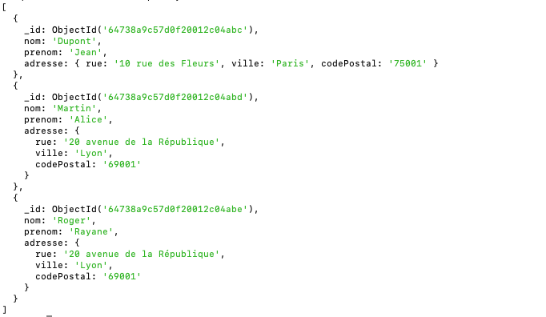

### **2. Insertion dans la collection `comptes`**

La collection `comptes` contient des informations sur les comptes bancaires, leur solde, leur type, et les clients associés.

```javascript
db.comptes.insertMany([
  {
    _id: ObjectId("64738b1c57d0f20012c04abf"),
    type: "Compte courant",
    solde: 5000,
    clients: [ObjectId("64738a9c57d0f20012c04abc")]
  },
  {
    _id: ObjectId("64738b1c57d0f20012c04ac0"),
    type: "Compte épargne",
    solde: 12000,
    clients: [ObjectId("64738a9c57d0f20012c04abc"), ObjectId("64738a9c57d0f20012c04abd")] // Compte joint
  },
  {
    _id: ObjectId("64738b1c57d0f20012c04ac1"),
    type: "Compte courant",
    solde: 7000,
    clients: [ObjectId("64738a9c57d0f20012c04abe")]
  }
]);
```
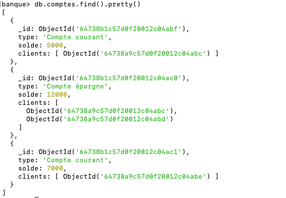

### **3. Insertion dans la collection `transactions`**

La collection `transactions` contient l’historique des opérations effectuées sur les comptes bancaires.

```javascript
db.transactions.insertMany([
  {
    _id: ObjectId("64738c1c57d0f20012c04ac2"),
    compteId: ObjectId("64738b1c57d0f20012c04abf"), 
    type: "Dépôt",
    montant: 1000,
    date: ISODate("2024-11-10T10:00:00Z")
  },
  {
    _id: ObjectId("64738c1c57d0f20012c04ac3"),
    compteId: ObjectId("64738b1c57d0f20012c04ac0"), 
    type: "Retrait",
    montant: 500,
    date: ISODate("2024-11-15T15:00:00Z")
  },
  {
    _id: ObjectId("64738c1c57d0f20012c04ac4"),
    compteId: ObjectId("64738b1c57d0f20012c04ac1"), 
    type: "Dépôt",
    montant: 2000,
    date: ISODate("2024-11-20T18:30:00Z")
  }
]);
```
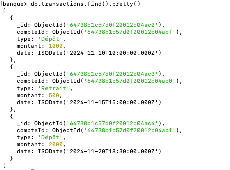

### **4. Requêtes pour interroger les données**

#### **a. Afficher tous les comptes avec leurs clients associés**
Utilisez une agrégation pour relier les comptes et leurs clients via l'opération `$lookup` :

```javascript
db.comptes.aggregate([
  {
    $lookup: {
      from: "clients",
      localField: "clients",
      foreignField: "_id",
      as: "beneficiaires"
    }
  }
]).pretty();
```

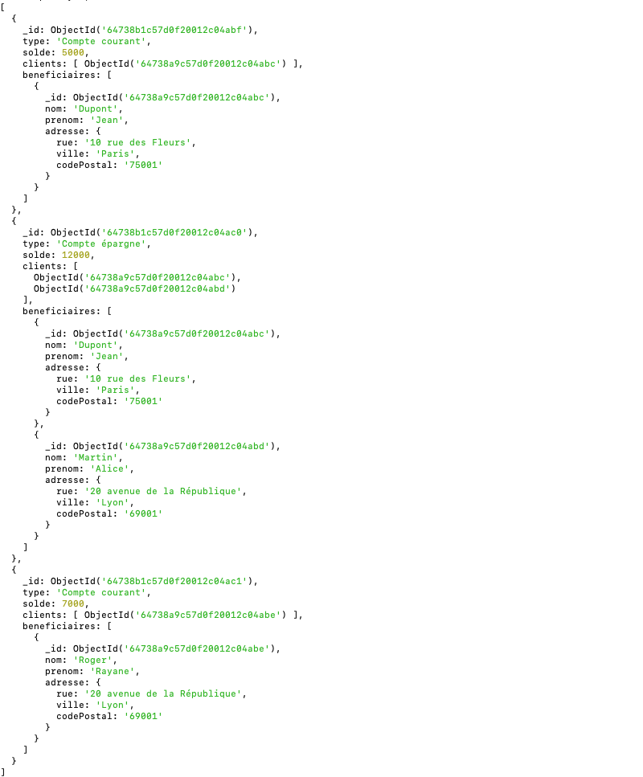

#### **b. Afficher les transactions d’un compte spécifique**
Par exemple, pour le compte courant de Jean Dupont (`64738b1c57d0f20012c04abf`) :

```javascript
db.transactions.find({ compteId: ObjectId("64738b1c57d0f20012c04abf") }).pretty();
```
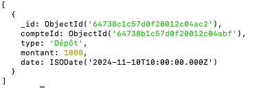

#### **c. Calculer le total des dépôts pour un compte**
Pour le compte courant de Jean Dupont (`64738b1c57d0f20012c04abf`), on peut filtrer et sommer les montants :

```javascript
db.transactions.aggregate([
  { $match: { compteId: ObjectId("64738b1c57d0f20012c04abf"), type: "Dépôt" } },
  { $group: { _id: "$compteId", totalDepots: { $sum: "$montant" } } }
]);
```

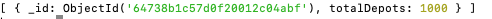

#### **d. Vérifier le solde après les transactions**
Simuler le solde final basé sur les transactions. Par exemple, pour le compte courant de Rayane Roger (`64738b1c57d0f20012c04ac1`) :

```javascript
db.transactions.aggregate([
  { $match: { compteId: ObjectId("64738b1c57d0f20012c04ac1") } },
  {
    $group: {
      _id: "$compteId",
      totalOperations: {
        $sum: {
          $cond: [
            { $eq: ["$type", "Dépôt"] },
            "$montant", // Ajouter pour les dépôts
            { $multiply: ["$montant", -1] } // Soustraire pour les retraits
          ]
        }
      }
    }
  }
]);
```
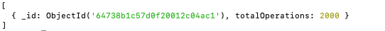

### **Ajout de nouvelles transactions**

```javascript
db.transactions.insertMany([
  {
    _id: ObjectId("64738c1c57d0f20012c04ac5"),
    compteId: ObjectId("64738b1c57d0f20012c04abf"), // Compte courant - Jean Dupont
    type: "Retrait",
    montant: 200,
    date: ISODate("2024-11-21T09:00:00Z")
  },
  {
    _id: ObjectId("64738c1c57d0f20012c04ac6"),
    compteId: ObjectId("64738b1c57d0f20012c04ac0"), // Compte épargne - Jean Dupont et Alice Martin
    type: "Dépôt",
    montant: 3000,
    date: ISODate("2024-11-22T11:30:00Z")
  },
  {
    _id: ObjectId("64738c1c57d0f20012c04ac7"),
    compteId: ObjectId("64738b1c57d0f20012c04ac1"), // Compte courant - Rayane Roger
    type: "Retrait",
    montant: 1500,
    date: ISODate("2024-11-23T14:45:00Z")
  },
  {
    _id: ObjectId("64738c1c57d0f20012c04ac8"),
    compteId: ObjectId("64738b1c57d0f20012c04ac0"), // Compte épargne - Jean Dupont et Alice Martin
    type: "Retrait",
    montant: 1000,
    date: ISODate("2024-11-24T16:00:00Z")
  },
  {
    _id: ObjectId("64738c1c57d0f20012c04ac9"),
    compteId: ObjectId("64738b1c57d0f20012c04abf"), // Compte courant - Jean Dupont
    type: "Dépôt",
    montant: 500,
    date: ISODate("2024-11-25T08:20:00Z")
  },
  {
    _id: ObjectId("64738c1c57d0f20012c04aca"),
    compteId: ObjectId("64738b1c57d0f20012c04ac1"), // Compte courant - Rayane Roger
    type: "Dépôt",
    montant: 400,
    date: ISODate("2024-11-26T10:10:00Z")
  },
  {
    _id: ObjectId("64738c1c57d0f20012c04acb"),
    compteId: ObjectId("64738b1c57d0f20012c04abf"), // Compte courant - Jean Dupont
    type: "Retrait",
    montant: 50,
    date: ISODate("2024-11-27T12:00:00Z")
  }
]);
```

#### **Requêtes intéressantes avec ces nouvelles transactions**

#### **a. Solde actuel de chaque compte basé sur les transactions**
Cette requête calcule le solde final de chaque compte en tenant compte des transactions :

```javascript
db.transactions.aggregate([
  {
    $group: {
      _id: "$compteId",
      totalOperations: {
        $sum: {
          $cond: [
            { $eq: ["$type", "Dépôt"] },
            "$montant", // Ajouter pour les dépôts
            { $multiply: ["$montant", -1] } // Soustraire pour les retraits
          ]
        }
      }
    }
  },
  {
    $lookup: {
      from: "comptes",
      localField: "_id",
      foreignField: "_id",
      as: "compte"
    }
  },
  {
    $project: {
      _id: 0,
      compteId: "$_id",
      type: { $arrayElemAt: ["$compte.type", 0] },
      soldeFinal: { $add: [{ $arrayElemAt: ["$compte.solde", 0] }, "$totalOperations"] }
    }
  }
]);
```
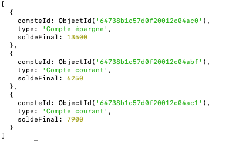

#### **b. Transactions d’un client spécifique (Jean Dupont)**
Pour obtenir toutes les transactions associées à Jean Dupont, pour trouver ses comptes et filtrer les transactions :

```javascript
db.comptes.aggregate([
  { $match: { clients: ObjectId("64738a9c57d0f20012c04abc") } },
  { $lookup: { from: "transactions", localField: "_id", foreignField: "compteId", as: "transactions" } },
  { $project: { _id: 0, type: 1, transactions: 1 } }
]);
```
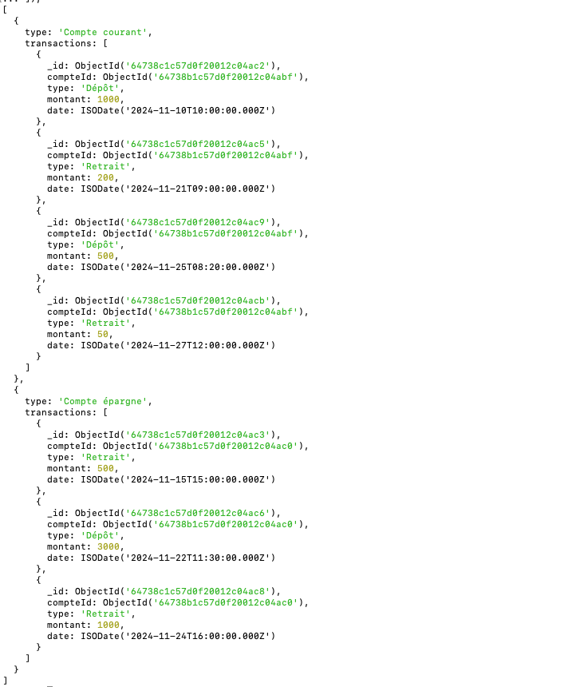

#### **c. Nombre total de transactions par type (Dépôt ou Retrait)**
Cette requête compte combien de dépôts et retraits ont été effectués pour tous les comptes :

```javascript
db.transactions.aggregate([
  {
    $group: {
      _id: "$type",
      totalTransactions: { $sum: 1 },
      montantTotal: { $sum: "$montant" }
    }
  }
]);
```
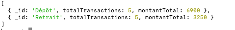

#### **d. Transactions dépassant un montant spécifique (par ex., 1000 €)**
Pour afficher toutes les transactions où le montant dépasse 1000 € :

```javascript
db.transactions.find({ montant: { $gt: 1000 } }).pretty();
```
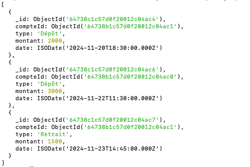