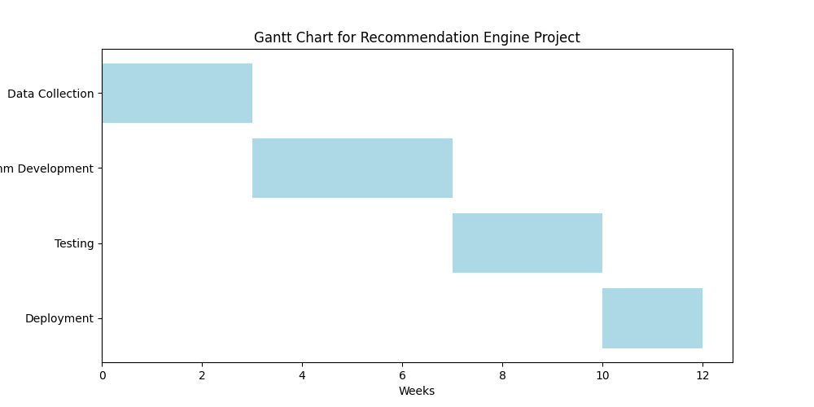
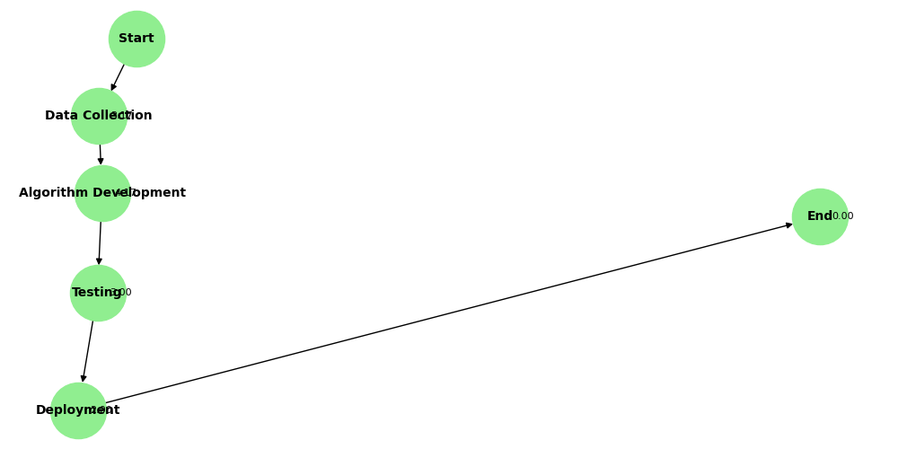

# Développement de Diagrammes de Gantt et de PERT

## Introduction
Dans cette quête, nous avons créé un diagramme de Gantt et un diagramme de PERT pour la mise en place d'un moteur de recommandations pour une plateforme de e-commerce. Le projet inclut plusieurs phases : la collecte de données, le développement de l'algorithme, les tests et le déploiement.

### 1. Diagramme de Gantt
Le diagramme de Gantt est un outil visuel qui permet de suivre les phases du projet, de planifier les délais, et de voir les dépendances.

- **Phases principales :**
  - **Collecte de Données** : 3 semaines
  - **Développement de l'Algorithme** : 4 semaines
  - **Tests** : 3 semaines
  - **Déploiement** : 2 semaines

Voici le diagramme de Gantt généré :


### 2. Diagramme de PERT
Le diagramme de PERT permet d'analyser et de planifier le projet en utilisant des estimations optimistes, les plus probables, et pessimistes pour chaque tâche.

#### Calcul du Temps Attendu
La formule utilisée pour le temps attendu est :
\[ TE = \frac{O + 4M + P}{6} \]

- **Collecte de Données** : 3,17 semaines
- **Développement de l'Algorithme** : 4,17 semaines
- **Tests** : 3,00 semaines
- **Déploiement** : 2,00 semaines

### Chemin Critique
Le chemin critique est : **Début → Collecte de Données → Développement de l'Algorithme → Tests → Déploiement → Fin**, avec une durée totale de **12,33 semaines**.

Voici le diagramme de PERT généré :


## Code Utilisé
```python
import pandas as pd
import matplotlib.pyplot as plt
import networkx as nx

# Données pour le diagramme de Gantt
gantt_data = {
    'Task': ['Data Collection', 'Algorithm Development', 'Testing', 'Deployment'],
    'Start': [0, 3, 7, 10],
    'Duration': [3, 4, 3, 2],
}
gantt_df = pd.DataFrame(gantt_data)

# Création du diagramme de Gantt
fig, ax = plt.subplots(figsize=(10, 5))
for index, row in gantt_df.iterrows():
    ax.barh(row['Task'], row['Duration'], left=row['Start'], color='lightblue')
ax.set_xlabel('Weeks')
ax.set_title('Gantt Chart for Recommendation Engine Project')
ax.invert_yaxis()
plt.savefig('gantt_chart.png')  # Sauvegarder l'image

# Données pour le diagramme de PERT
pert_data = {
    'Task': ['Data Collection', 'Algorithm Development', 'Testing', 'Deployment'],
    'Optimistic': [2, 3, 2, 1],
    'Most Likely': [3, 4, 3, 2],
    'Pessimistic': [5, 6, 4, 3],
}
pert_df = pd.DataFrame(pert_data)
pert_df['Expected Time'] = (pert_df['Optimistic'] + 4 * pert_df['Most Likely'] + pert_df['Pessimistic']) / 6

# Création du diagramme de PERT
G = nx.DiGraph()
G.add_edges_from([
    ('Start', 'Data Collection'),
    ('Data Collection', 'Algorithm Development'),
    ('Algorithm Development', 'Testing'),
    ('Testing', 'Deployment'),
    ('Deployment', 'End')
])
weights = {
    ('Start', 'Data Collection'): pert_df.loc[0, 'Expected Time'],
    ('Data Collection', 'Algorithm Development'): pert_df.loc[1, 'Expected Time'],
    ('Algorithm Development', 'Testing'): pert_df.loc[2, 'Expected Time'],
    ('Testing', 'Deployment'): pert_df.loc[3, 'Expected Time'],
    ('Deployment', 'End'): 0
}
nx.set_edge_attributes(G, weights, 'weight')
pos = nx.spring_layout(G)
plt.figure(figsize=(10, 5))
nx.draw(G, pos, with_labels=True, node_color='lightgreen', node_size=2000, font_size=10, font_weight='bold')
for (u, v, d) in G.edges(data=True):
    x, y = pos[v]
    plt.text(x + 0.02, y, f"{d['weight']:.2f}", fontsize=8, ha='left', va='center', color='black')
plt.title('PERT Chart for Recommendation Engine Project')
plt.savefig('pert_chart.png')  # Sauvegarder l'image
```
