# SQL : Conception avec Merise

Cette quête est faite avec **DB Browser for SQLite**, une excellente alternative pour travailler avec SQLite.

---

### **Étapes pour DB Browser for SQLite**

#### **1. Créer une base de données SQLite**
1. Ouvrir **DB Browser for SQLite**.
2. Cliquer sur **"New Database"** (Nouvelle base de données).
3. Choisisser un emplacement et un nom pour votre fichier SQLite (par exemple ico : `banque.db`).
4. La base de données est créée, et on peut commencer à définir les tables.

---

#### **2. Création des tables**

##### **Table `clients`**
```sql
CREATE TABLE clients (
    id_client INTEGER PRIMARY KEY AUTOINCREMENT,
    nom TEXT NOT NULL,
    prenom TEXT NOT NULL,
    rue TEXT,
    ville TEXT,
    code_postal TEXT
);
```
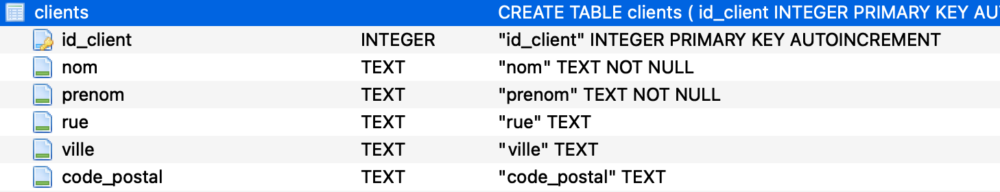

##### **Table `comptes`**
```sql
CREATE TABLE comptes (
    id_compte INTEGER PRIMARY KEY AUTOINCREMENT,
    type_compte TEXT CHECK(type_compte IN ('Compte courant', 'Compte épargne')) NOT NULL,
    solde REAL NOT NULL
);
```
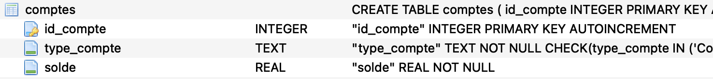

##### **Table `client_compte`**
```sql
CREATE TABLE client_compte (
    id_client INTEGER NOT NULL,
    id_compte INTEGER NOT NULL,
    PRIMARY KEY (id_client, id_compte),
    FOREIGN KEY (id_client) REFERENCES clients(id_client),
    FOREIGN KEY (id_compte) REFERENCES comptes(id_compte)
);
```


##### **Table `transactions`**
```sql
CREATE TABLE transactions (
    id_transaction INTEGER PRIMARY KEY AUTOINCREMENT,
    id_compte INTEGER NOT NULL,
    type_transaction TEXT CHECK(type_transaction IN ('Dépôt', 'Retrait')) NOT NULL,
    montant REAL NOT NULL,
    date_transaction TEXT NOT NULL,
    FOREIGN KEY (id_compte) REFERENCES comptes(id_compte)
);
```

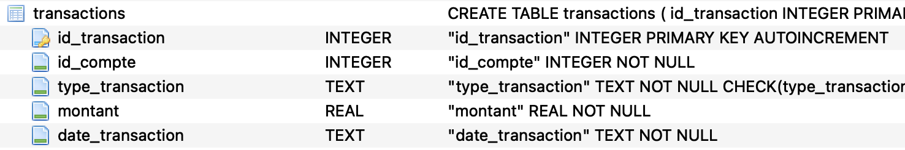


#### **3. Insertion des données**

##### **Données dans `clients`**
```sql
INSERT INTO clients (nom, prenom, rue, ville, code_postal) VALUES
('Dupont', 'Jean', '10 rue des Fleurs', 'Paris', '75001'),
('Martin', 'Alice', '20 avenue de la République', 'Lyon', '69001'),
('Roger', 'Rayane', '20 avenue de la République', 'Lyon', '69001');
```
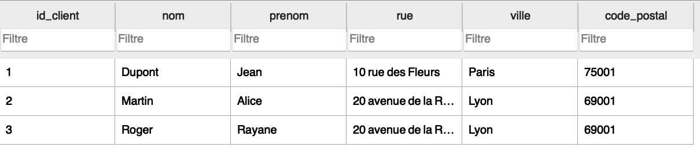

##### **Données dans `comptes`**
```sql
INSERT INTO comptes (type_compte, solde) VALUES
('Compte courant', 5000),
('Compte épargne', 12000),
('Compte courant', 7000);
```
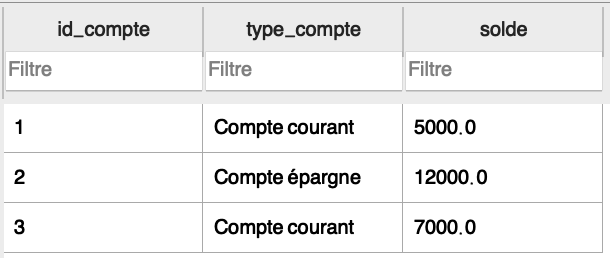

##### **Données dans `client_compte`**
```sql
INSERT INTO client_compte (id_client, id_compte) VALUES
(1, 1), -- Jean Dupont
(1, 2), -- Jean Dupont (compte joint)
(2, 2), -- Alice Martin (compte joint)
(3, 3); -- Rayane Roger
```
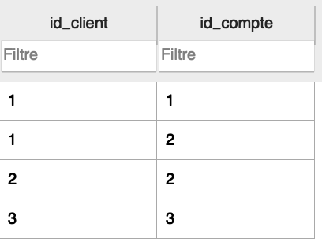

##### **Données dans `transactions`**
```sql
INSERT INTO transactions (id_compte, type_transaction, montant, date_transaction) VALUES
(1, 'Dépôt', 1000, '2024-11-10 10:00:00'),
(2, 'Retrait', 500, '2024-11-15 15:00:00'),
(3, 'Dépôt', 2000, '2024-11-20 18:30:00');
```

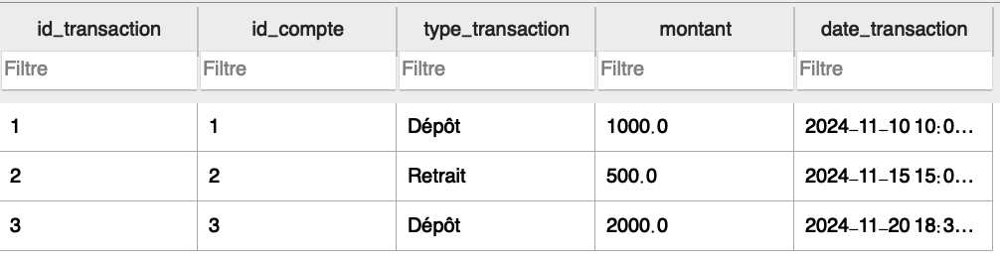

#### **4. Exécution des requêtes SQL**


##### **a. Afficher tous les comptes avec leurs clients associés**
```sql
SELECT 
    comptes.id_compte,
    comptes.type_compte,
    comptes.solde,
    clients.nom AS client_nom,
    clients.prenom AS client_prenom
FROM comptes
JOIN client_compte ON comptes.id_compte = client_compte.id_compte
JOIN clients ON client_compte.id_client = clients.id_client;
```

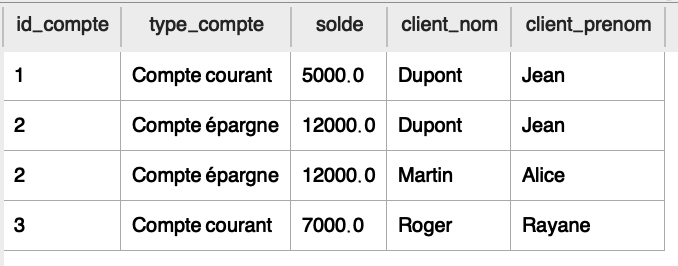

##### **b. Afficher les transactions d’un compte spécifique**
Pour le compte `1` :
```sql
SELECT 
    transactions.id_transaction,
    transactions.type_transaction,
    transactions.montant,
    transactions.date_transaction
FROM transactions
WHERE transactions.id_compte = 1;
```

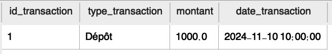

##### **c. Calculer le total des dépôts pour un compte**
Pour le compte `1` :
```sql
SELECT 
    id_compte,
    SUM(montant) AS total_depots
FROM transactions
WHERE id_compte = 1 AND type_transaction = 'Dépôt';
```

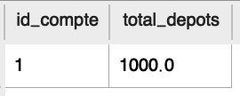

##### **d. Calculer le solde d’un compte après les transactions**
Pour le compte `3` :
```sql
SELECT 
    comptes.id_compte,
    comptes.solde + 
    COALESCE(SUM(
        CASE 
            WHEN transactions.type_transaction = 'Dépôt' THEN transactions.montant
            WHEN transactions.type_transaction = 'Retrait' THEN -transactions.montant
        END
    ), 0) AS solde_final
FROM comptes
LEFT JOIN transactions ON comptes.id_compte = transactions.id_compte
WHERE comptes.id_compte = 3
GROUP BY comptes.id_compte;
```

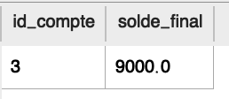

##### **e. Afficher toutes les transactions d’un client spécifique**
Pour le client `Jean Dupont` :
```sql
SELECT 
    transactions.id_transaction,
    transactions.type_transaction,
    transactions.montant,
    transactions.date_transaction,
    comptes.type_compte
FROM transactions
JOIN comptes ON transactions.id_compte = comptes.id_compte
JOIN client_compte ON comptes.id_compte = client_compte.id_compte
JOIN clients ON client_compte.id_client = clients.id_client
WHERE clients.nom = 'Dupont' AND clients.prenom = 'Jean';
```

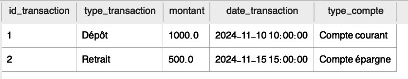


#### **5. Ajout des transactions supplémentaires**

```sql
INSERT INTO transactions (id_compte, type_transaction, montant, date_transaction) VALUES
(1, 'Retrait', 200, '2024-11-21 09:00:00'),
(2, 'Dépôt', 3000, '2024-11-22 11:30:00'),
(3, 'Retrait', 1500, '2024-11-23 14:45:00'),
(2, 'Retrait', 1000, '2024-11-24 16:00:00'),
(1, 'Dépôt', 500, '2024-11-25 08:20:00'),
(3, 'Dépôt', 400, '2024-11-26 10:10:00'),
(1, 'Retrait', 50, '2024-11-27 12:00:00');
```

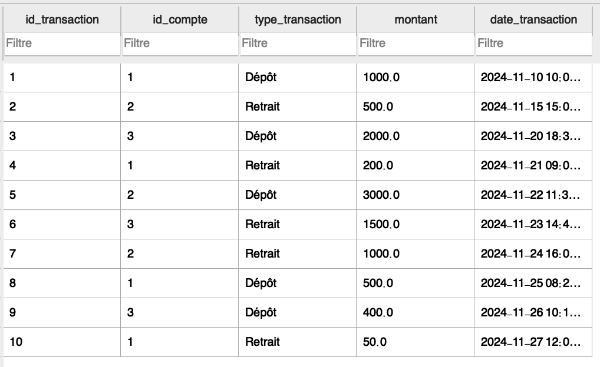


#### **Requêtes intéressantes avec ces nouvelles transactions**
### **a. Solde actuel de chaque compte basé sur les transactions**
Le solde est calculé en ajustant le solde initial avec les dépôts et retraits effectués.

```sql
SELECT 
    comptes.id_compte,
    comptes.type_compte,
    comptes.solde AS solde_initial,
    COALESCE(SUM(
        CASE 
            WHEN transactions.type_transaction = 'Dépôt' THEN transactions.montant
            WHEN transactions.type_transaction = 'Retrait' THEN -transactions.montant
        END
    ), 0) AS ajustement,
    comptes.solde + COALESCE(SUM(
        CASE 
            WHEN transactions.type_transaction = 'Dépôt' THEN transactions.montant
            WHEN transactions.type_transaction = 'Retrait' THEN -transactions.montant
        END
    ), 0) AS solde_final
FROM comptes
LEFT JOIN transactions ON comptes.id_compte = transactions.id_compte
GROUP BY comptes.id_compte;
```

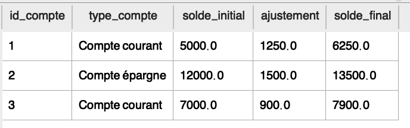
---

### **b. Transactions d’un client spécifique (Jean Dupont)**
Cette requête liste toutes les transactions associées à un client spécifique en fonction de son nom et prénom.

```sql
SELECT 
    transactions.id_transaction,
    transactions.type_transaction,
    transactions.montant,
    transactions.date_transaction,
    comptes.type_compte,
    comptes.id_compte
FROM transactions
JOIN comptes ON transactions.id_compte = comptes.id_compte
JOIN client_compte ON comptes.id_compte = client_compte.id_compte
JOIN clients ON client_compte.id_client = clients.id_client
WHERE clients.nom = 'Dupont' AND clients.prenom = 'Jean';
```
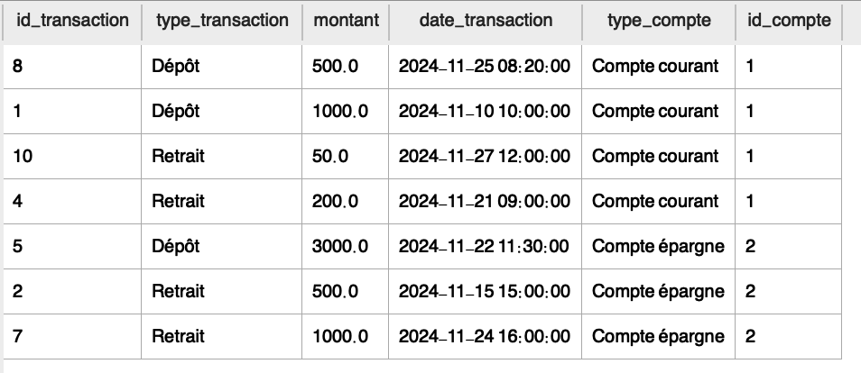

---

### **c. Nombre total de transactions par type (Dépôt ou Retrait)**
Cette requête compte les transactions de chaque type (Dépôt ou Retrait) et affiche également le montant total pour chaque type.

```sql
SELECT 
    type_transaction,
    COUNT(*) AS nombre_transactions,
    SUM(montant) AS montant_total
FROM transactions
GROUP BY type_transaction;
```
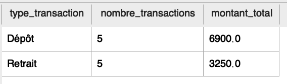
---

### **d. Transactions dépassant un montant spécifique (par ex., 1000 €)**

```sql
SELECT 
    transactions.id_transaction,
    transactions.id_compte,
    transactions.type_transaction,
    transactions.montant,
    transactions.date_transaction
FROM transactions
WHERE transactions.montant > 1000;
```
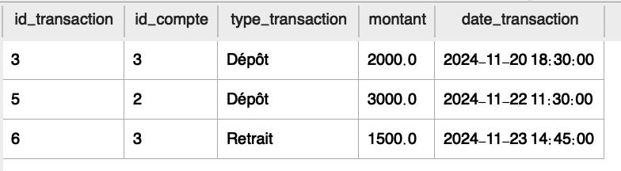